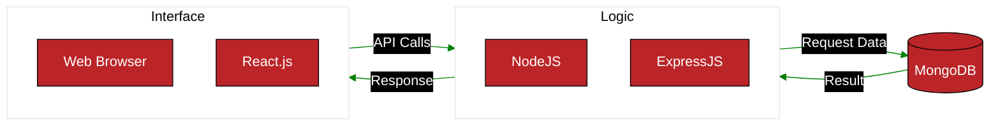

# System Architecture
## Class API Diagram

This is an overview of our API. The technologies we used are:

* **MongoDB** for our database
* **Express.js** and **Node.js** for our back-end
* **React.js** for our front-end

## Sequence Diagrams
### Core Feature: Blackjack
* Users can bet on a blackjack game that uses their real available balance. They have the ability to play a basic game of blackjack and be rewarded for winning or lose their money if the dealer wins. Their balance and stats are updated after each game.

### Create Account
* Users can create an account to access the games on the site.

### Core Feature: Login
* Users can login to their existing account to keep their progress.

### Core Feature: Safe Gambling (Notifications)
* Some standard safe gambling reminders are sent to anyone currently on the site after a certain amount of time. The notifications display for a few seconds before disappearing.
### Safe Gambling - Notifications

### Core Feature: Teaching Fundamentals
* Users can access a tutorial section that gives information on how to play the games available on the site.

### User Stats - Safe Gambling
* Users time and money limits are tracked to ensure safe gambling practices. They will be locked out for the day if they hit these limits.

### User Stats
* User stats like wins or losses are tracked and they can view it from their profile or leaderboard section.

### Poker Minigame
* Users can play a poker minigame similar to Balatro but heavily simplified. They can choose a difficulty and place a bet. If they hit the target score after they run out of hands to play, they win and get rewarded based on bet size and difficulty.
