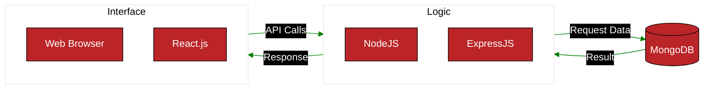
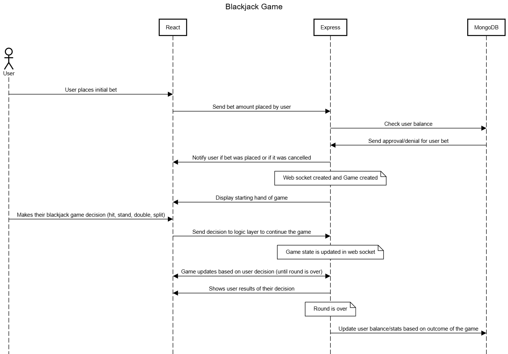
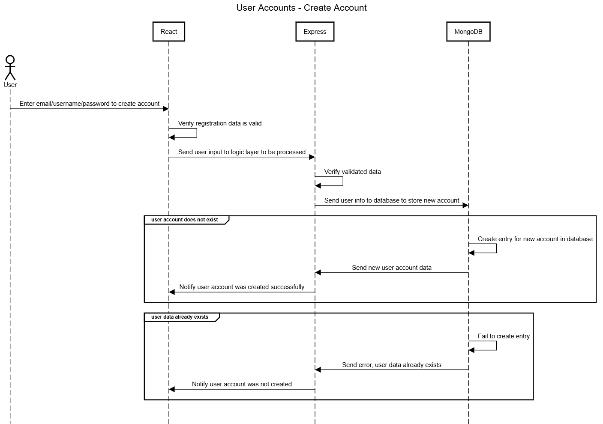
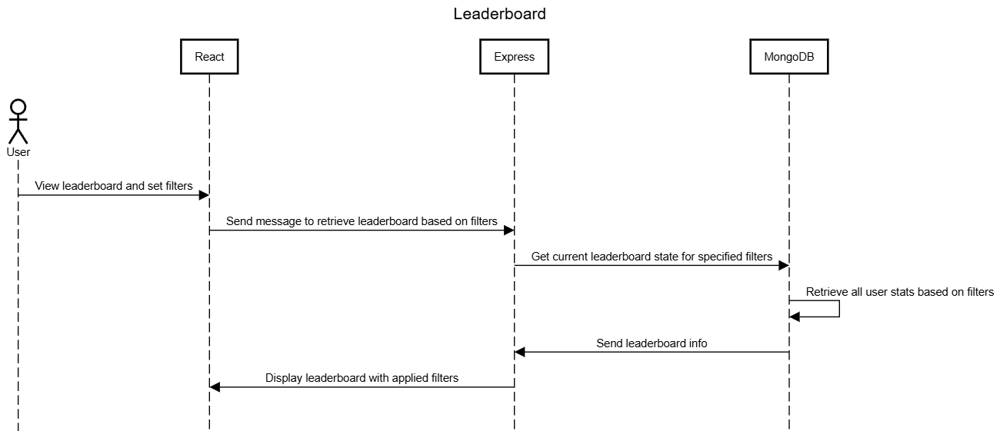
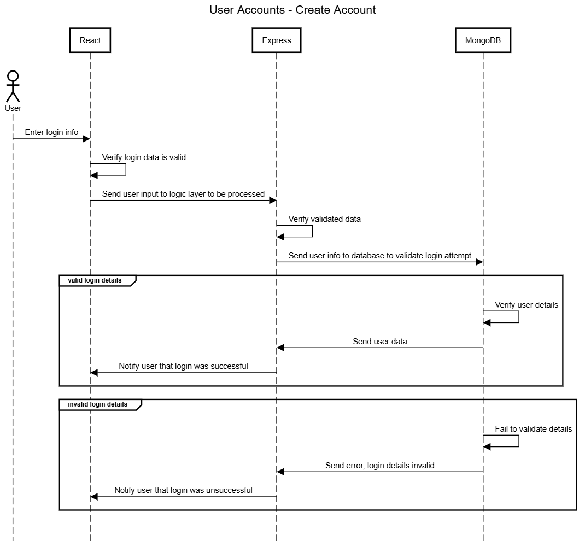
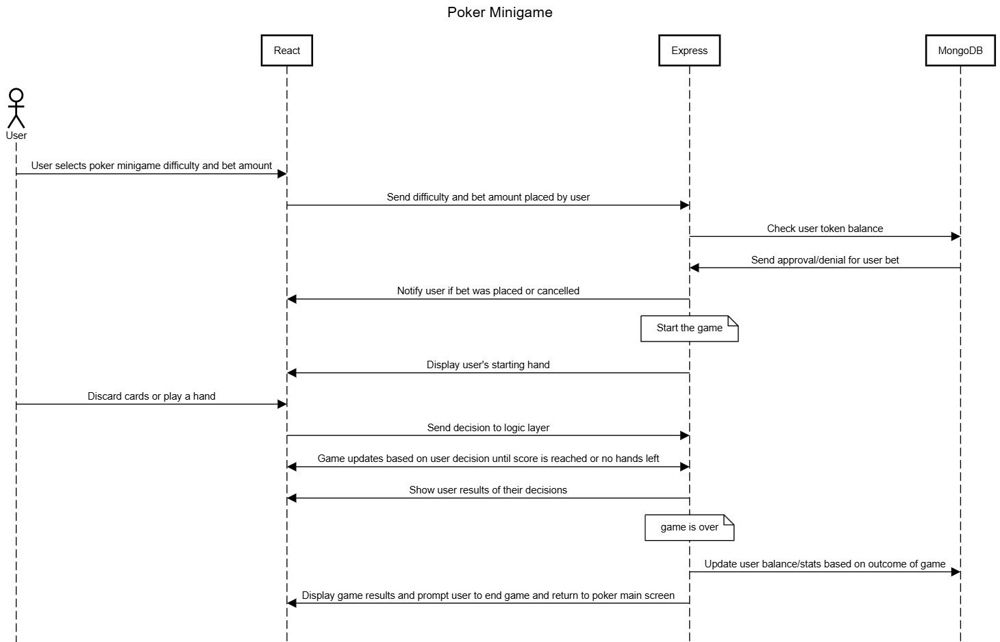
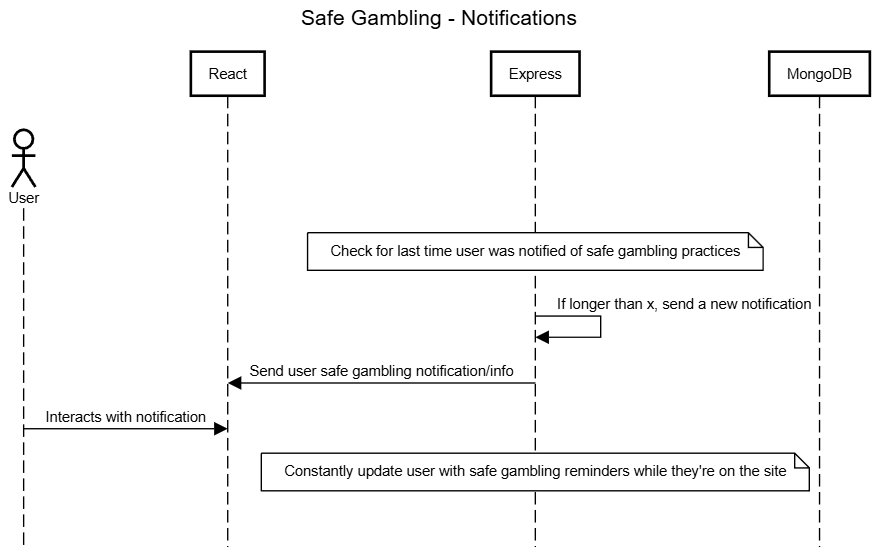
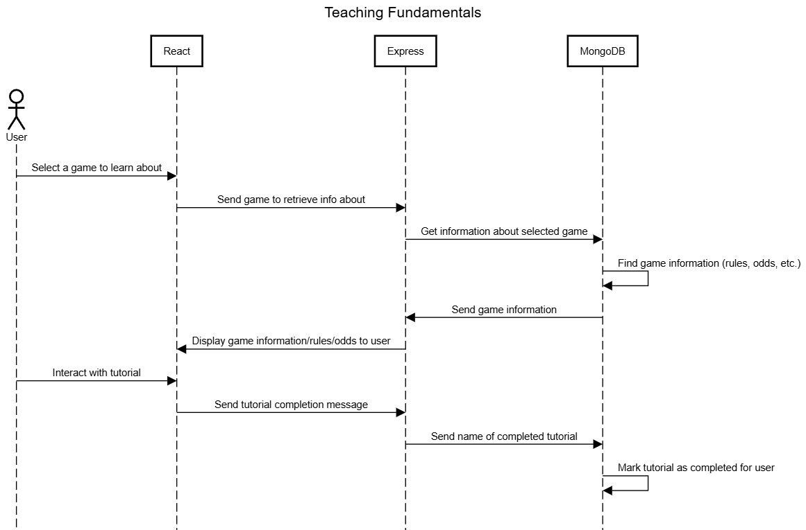
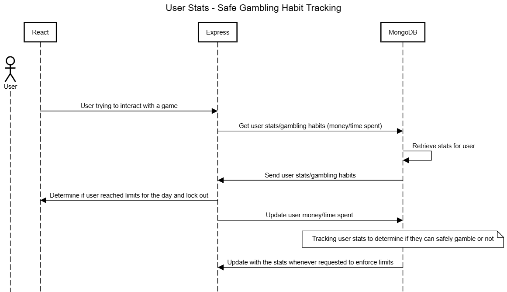
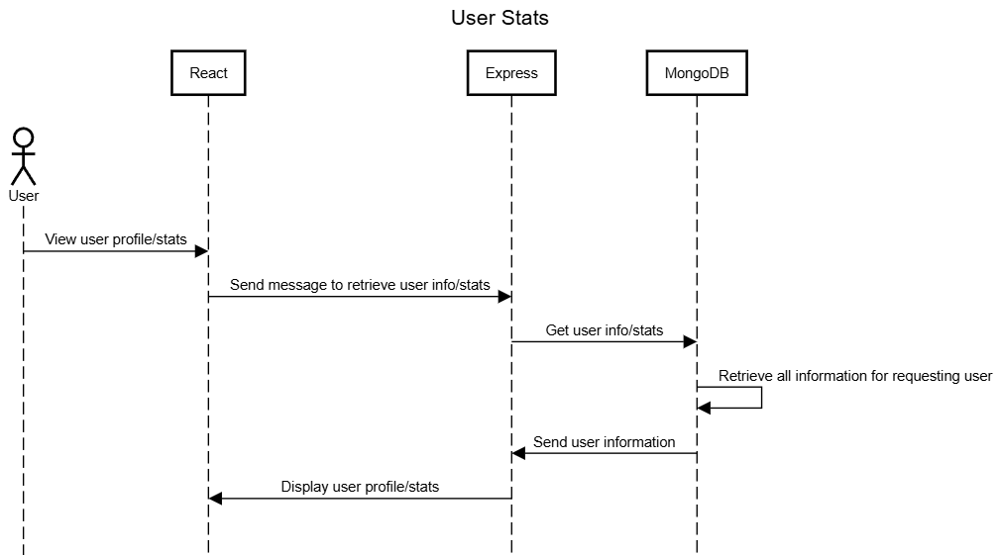

# System Architecture
## Class API Diagram

This is an overview of our API. The technologies we used are:

* **MongoDB** for our database
* **Express.js** and **Node.js** for our back-end
* **React.js** for our front-end

## Sequence Diagrams
### Blackjack

Currently the betting feature for blackjack is not yet implemented. The top portion of the sequence diagram that shows bets being placed and checks being made on the users balance will *eventually* be implemented exactly like this so it will reflect our working system in the future. Also the very last interaction in the diagram shows the balance being updated which doesn't happen yet but the user's stats are currently being updated based on a win or a loss.

### Create Account

### Leaderboard

### Login

### Poker Minigame

This sequence diagaram is for a future feature. This diagram represents how we plan to implement this feature but may change when we actually implement it.

### Safe Gambling - Notifications

Currently there is no calls to the database for this feature. The safe gambling warnings are just simply on a timer at the Express layer of this diagram. In the future we plan to implement the database interaction to send users warnings that relate to their user info/stats. For the current state of the project, the reminders are simply on a timer.

### Teaching Fundamentals

Everything in this sequence diagram is working as described in our system up until the point where a user interacts with a tutorial. They are able to view it and see any information it displays and interact with it, but nothing is logged in the database yet in terms of marking a tutorial as completed. This will be something we add in the future.

### User Stats - Safe Gambling

This section of the Safe Gambling feature is not yet implemented. This is something we will implement in the future of the project.

### User Stats

