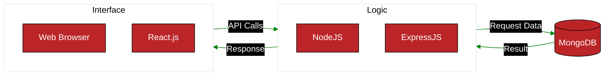

```mermaid
%%{
  init: {
    'theme': 'base',
    'themeVariables': {
      'primaryColor': '#BB2528',
      'primaryTextColor': '#fff',
      'primaryBorderColor': 'Black',
      'lineColor': 'Green',
      'secondaryColor': 'Black',
      'tertiaryColor': '#fff'
    }
  }
}%%

flowchart LR

    DB[(MongoDB)] -->|Result| Logic
    subgraph Logic
        NodeJS
        ExpressJS
    end
    Logic -->|Request Data| DB
    Logic -->|Response| Interface
    subgraph Interface
        Browser[Web Browser]
        React.js
    end
    Interface -->|API Calls| Logic
```
