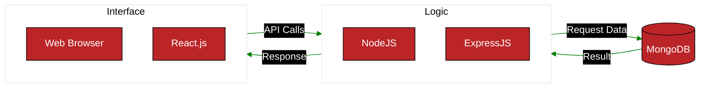

# System Architecture
## Class API Diagram

This is an overview of our API. The technologies we used are:

* **MongoDB** for our database
* **Express.js** and **Node.js** for our back-end
* **React.js** for our front-end

## Sequence Diagrams
### Blackjack

### Create Account

### Leaderboard

### Login

### Poker Minigame

### Safe Gambling - Notifications

### Teaching Fundamentals

### User Stats - Safe Gambling

### User Stats
