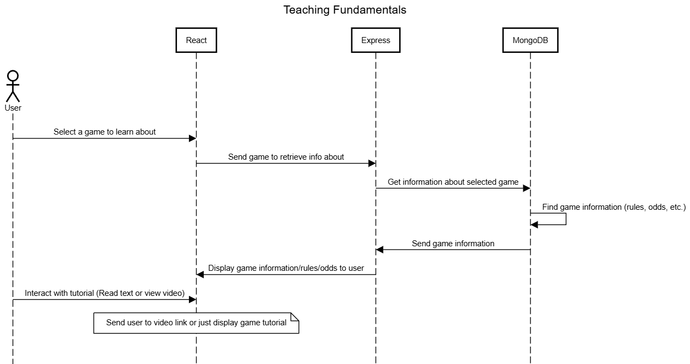

# System Architecture
## Class API Diagram

This is an overview of our API. The technologies we used are:

* **MongoDB** for our database
* **Express.js** and **Node.js** for our back-end
* **React.js** for our front-end

## Sequence Diagrams
### Core Feature: Blackjack
* We will incorporate a blackjack game where users can bet with money or tokens. They will have the ability to stand, double down, hit, or split while each each win/lose game will be recorded into your account. 

### Core Feature: Create Account
* Users will have the ability to create their account and add themselves to the leaderboard by picking a unique username what will be verified before their account is registered. 

### Core Feature: Login
* Returning users will have to login where their activity will be saved under their unique username.

### Core Feature: Safe Gambling (Notifications)
* As the users play the game, behind the scenes, the game is iterating through currently active users and checking whether they need to receive notifications. If they do, an iteraction between the user and UI must be completed in order for the user's notification clock to be reset. 

### Core Feature: Safe Gambling (User Stats)
* Behind the scenes, we are analyzing gambling patterns and frequencies to know how often and what kind of notifications the user should be receiving in order to help mitigate their gambling habits. 

### Core Feature: Teaching Fundamentals
* As the user seeks help and tutorials from the game, we will keep track of which ones the user has completed in order to save their progress. 

### Core Feature: Leaderboard
* The leaderboard is a chance to promote of the top users in the game (Full Stack Flush). It will show results according to the filters the user has selected. 

### Core Feature: User Stats
* Users will have the opportunity to track their stats since they created their account. This will keep track of their wins, loses, and gambling habits based on the analysis. 

### Core Feature: Poker Minigame
* The Poker Minigame will be a chance for players to play a miniaturized version of poker, similar to the video game Balatro. This game will allow the users play or discard their hands based on how much they bet in the first place, and get a change to win more when their goal is reached. 

